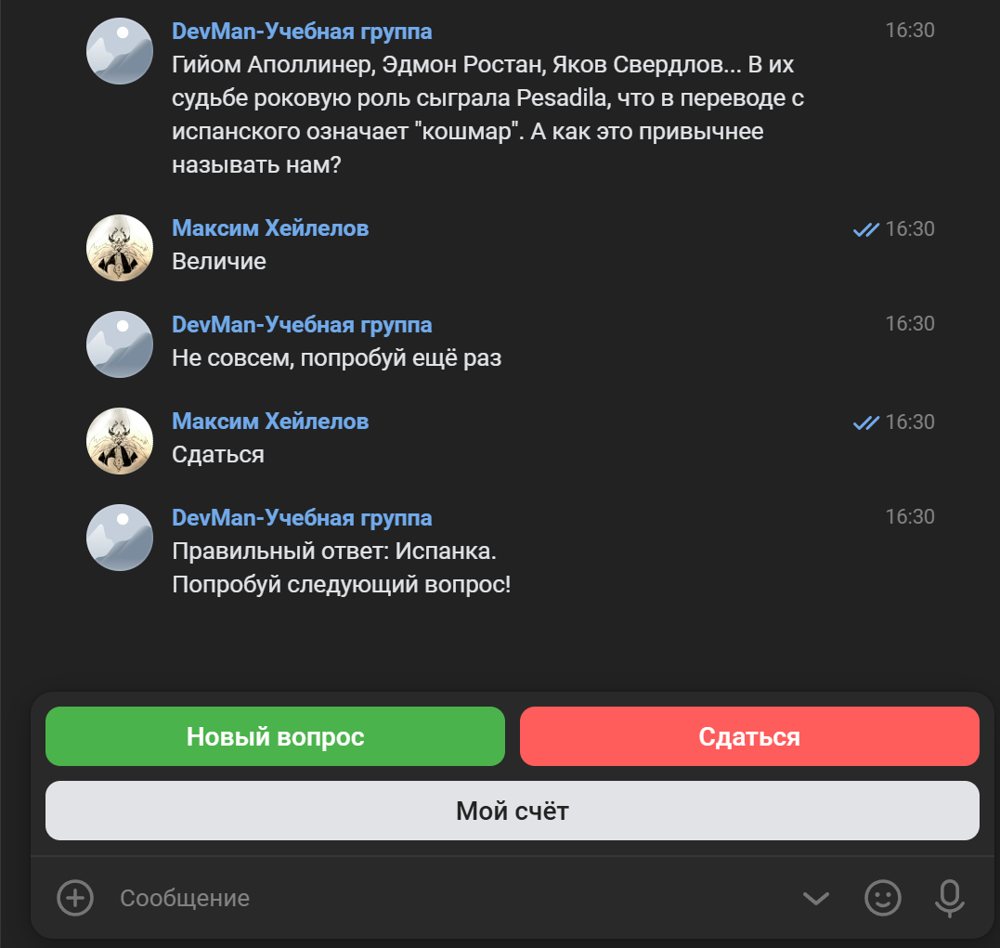
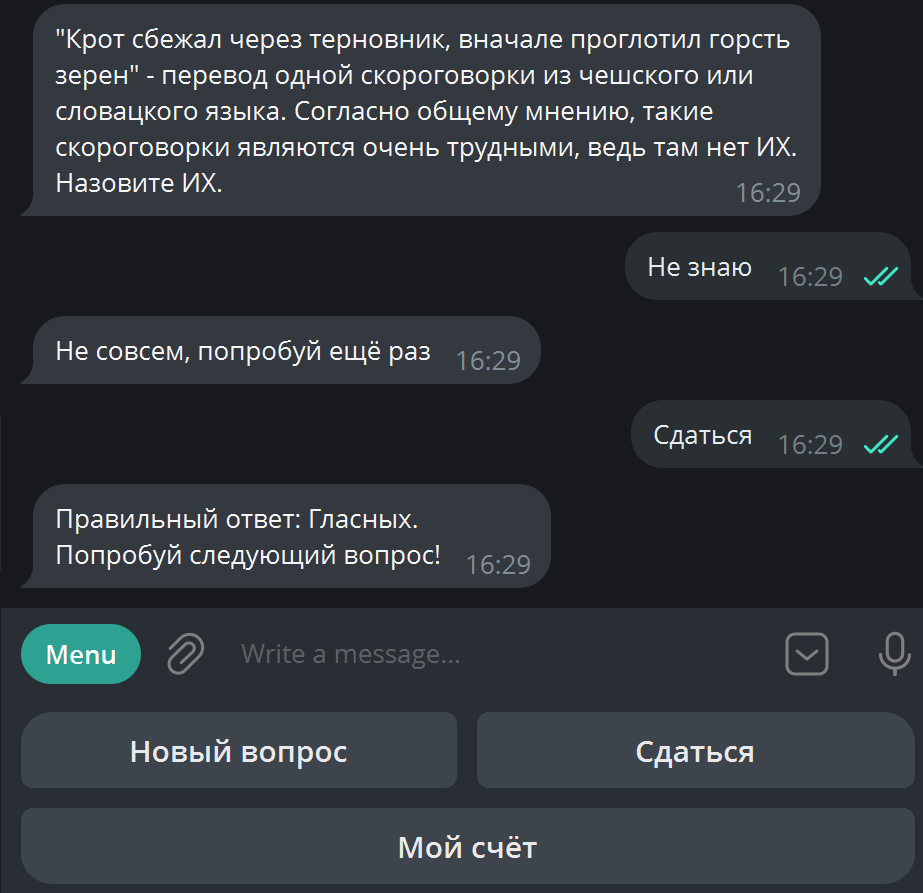

# Боты-викторины для Telegram и VK

Боты для проведения викторин на основе вопросов из Что-Где-Когда.



### Как установить
Для работы с ботами требуются API-ключи бота в телеграме (можно получить по адресу [@BotFather](https://t.me/BotFather)) и вашей группы в ВК (получаются в настройках вашей группы после выдачи всех нужных разрешений).

Они должны быть указаны в файле окружения .env в виде:
```
TELEGRAM_BOT_TOKEN=[API]
VK_API=[API]
```

Также для работы со скриптами нужен Redis. Сервис доступен для Linux или виртуальной машины WSL, устанавливается командами:

`sudo apt install redis-server`

`sudo systemctl start redis-server`

В .env нужно указать переменные окружения в формате:
```
REDIS_HOST=localhost
REDIS_PORT=6379
REDIS_PASSWORD=
```

Python3 должен быть уже установлен. Затем используйте `pip` (или `pip3`, если есть конфликт с Python2) для установки зависимостей:

`pip install -r requirements.txt`

Боты рассчитаны для работы с файлами викторин из открытой базы вопросов Что-Где-Когда.
Скачать архив вы можете по ссылке [тут](https://drive.google.com/file/d/1ggcRpH8MlJQAEzK8CtevSIj_nVdhzmhQ/view?usp=sharing)

Желаемые файлы в формате `.txt` нужно распаковать в директорию внутри корня проекта.

### Как использовать

Запустите нужного бота, указав папку с файлами вопросов и имя папки с вопросами в качестве аргумента:

`python tg_bot.py [directory]`

`python vk_bot.py [directory]`


### Цель проекта

Код написан в образовательных целях на онлайн-курсе для веб-разработчиков [dvmn.org](https://dvmn.org/).